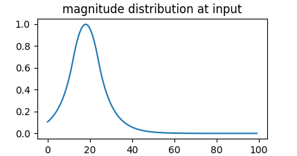
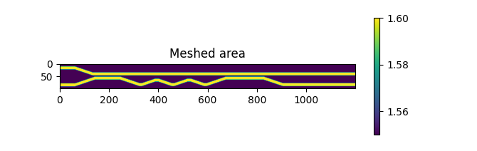
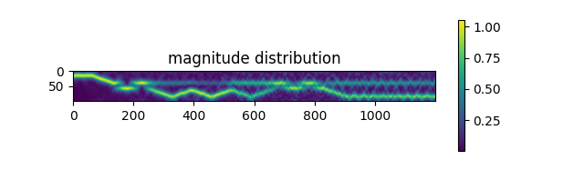
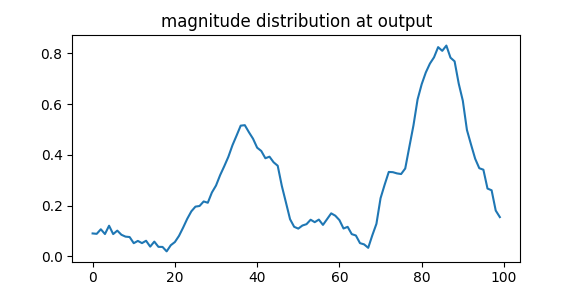

# 2D-BPM
Keywords: Beam-Propagation-Method, 2D, Scalar, Pade(1,1)
Implementation of a simple Pade(1,1) Beam Propagation.

## Setup and start

* After cloning the repository install the dependencies by running:  
```
> pip install -r requierements.txt  
```
* The simulation should be started by running:
```
> python Simulation_scode.py  
``` 

## Walkthrough

1. The first step is to create the simulation area.  It is internally represented by an 2D array which stores the refractive indexes.  
1. Some constraints are defined: 
    resolution (pixel per um) and simulation frequency
1. The eigenvalue ( fundamental mode) of the waveguide at the input plane is calculated  
1. The magnitude at the input plane is plotted.  

1. The meshed simulation area is plotted.  
  
1. The beam propagation method is executed, this may take some seconds. The script will output a alive message by printing out: 
```
-----> running
```  
7. The simulated magnitude distribution is plotted.  
 
1. The magnitude distribution at the output plane is plotted.  
 


## Known issues

The simulation is not energy preserving due to inaccuracy, rounding and edge effects.  


